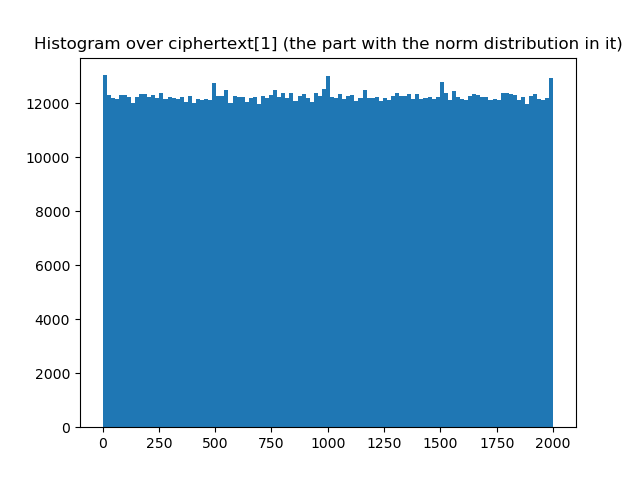

# I took a look at the Learning With Errors cryptoprimitive.

Sample textbook implementation of LWE, full of assertions.

Tested with Python 3.8.5.

Running the script should look similar to the following:

```
== Experiment 1: is the observed error probability as expected? ==
Hamming distance of original plaintext vs decrypted text (i.e. wrong bits): 1, error ratio: 0.7352941176470588%
Hamming distance of original plaintext vs decrypted text (i.e. wrong bits): 1, error ratio: 0.7352941176470588%
Hamming distance of original plaintext vs decrypted text (i.e. wrong bits): 0, error ratio: 0.0%
Hamming distance of original plaintext vs decrypted text (i.e. wrong bits): 0, error ratio: 0.0%
Hamming distance of original plaintext vs decrypted text (i.e. wrong bits): 3, error ratio: 2.2058823529411766%
Hamming distance of original plaintext vs decrypted text (i.e. wrong bits): 0, error ratio: 0.0%
Hamming distance of original plaintext vs decrypted text (i.e. wrong bits): 3, error ratio: 2.2058823529411766%
Hamming distance of original plaintext vs decrypted text (i.e. wrong bits): 1, error ratio: 0.7352941176470588%
Hamming distance of original plaintext vs decrypted text (i.e. wrong bits): 1, error ratio: 0.7352941176470588%
Hamming distance of original plaintext vs decrypted text (i.e. wrong bits): 1, error ratio: 0.7352941176470588%
Hamming distance of original plaintext vs decrypted text (i.e. wrong bits): 0, error ratio: 0.0%
Hamming distance of original plaintext vs decrypted text (i.e. wrong bits): 2, error ratio: 1.4705882352941175%
Hamming distance of original plaintext vs decrypted text (i.e. wrong bits): 0, error ratio: 0.0%
Hamming distance of original plaintext vs decrypted text (i.e. wrong bits): 0, error ratio: 0.0%
Hamming distance of original plaintext vs decrypted text (i.e. wrong bits): 0, error ratio: 0.0%
Hamming distance of original plaintext vs decrypted text (i.e. wrong bits): 3, error ratio: 2.2058823529411766%
Hamming distance of original plaintext vs decrypted text (i.e. wrong bits): 2, error ratio: 1.4705882352941175%
Hamming distance of original plaintext vs decrypted text (i.e. wrong bits): 0, error ratio: 0.0%
Hamming distance of original plaintext vs decrypted text (i.e. wrong bits): 1, error ratio: 0.7352941176470588%
Hamming distance of original plaintext vs decrypted text (i.e. wrong bits): 2, error ratio: 1.4705882352941175%
Hamming distance of original plaintext vs decrypted text (i.e. wrong bits): 2, error ratio: 1.4705882352941175%
Hamming distance of original plaintext vs decrypted text (i.e. wrong bits): 2, error ratio: 1.4705882352941175%
Hamming distance of original plaintext vs decrypted text (i.e. wrong bits): 1, error ratio: 0.7352941176470588%
Hamming distance of original plaintext vs decrypted text (i.e. wrong bits): 1, error ratio: 0.7352941176470588%
Hamming distance of original plaintext vs decrypted text (i.e. wrong bits): 2, error ratio: 1.4705882352941175%
Hamming distance of original plaintext vs decrypted text (i.e. wrong bits): 0, error ratio: 0.0%
Hamming distance of original plaintext vs decrypted text (i.e. wrong bits): 1, error ratio: 0.7352941176470588%
Hamming distance of original plaintext vs decrypted text (i.e. wrong bits): 3, error ratio: 2.2058823529411766%
Hamming distance of original plaintext vs decrypted text (i.e. wrong bits): 0, error ratio: 0.0%
Hamming distance of original plaintext vs decrypted text (i.e. wrong bits): 1, error ratio: 0.7352941176470588%
Hamming distance of original plaintext vs decrypted text (i.e. wrong bits): 1, error ratio: 0.7352941176470588%
Hamming distance of original plaintext vs decrypted text (i.e. wrong bits): 1, error ratio: 0.7352941176470588%
Hamming distance of original plaintext vs decrypted text (i.e. wrong bits): 0, error ratio: 0.0%
Hamming distance of original plaintext vs decrypted text (i.e. wrong bits): 3, error ratio: 2.2058823529411766%
Hamming distance of original plaintext vs decrypted text (i.e. wrong bits): 3, error ratio: 2.2058823529411766%
Hamming distance of original plaintext vs decrypted text (i.e. wrong bits): 0, error ratio: 0.0%
Hamming distance of original plaintext vs decrypted text (i.e. wrong bits): 1, error ratio: 0.7352941176470588%
Hamming distance of original plaintext vs decrypted text (i.e. wrong bits): 3, error ratio: 2.2058823529411766%
Hamming distance of original plaintext vs decrypted text (i.e. wrong bits): 1, error ratio: 0.7352941176470588%
Hamming distance of original plaintext vs decrypted text (i.e. wrong bits): 0, error ratio: 0.0%
Hamming distance of original plaintext vs decrypted text (i.e. wrong bits): 1, error ratio: 0.7352941176470588%
Hamming distance of original plaintext vs decrypted text (i.e. wrong bits): 4, error ratio: 2.941176470588235%
Hamming distance of original plaintext vs decrypted text (i.e. wrong bits): 1, error ratio: 0.7352941176470588%
Hamming distance of original plaintext vs decrypted text (i.e. wrong bits): 1, error ratio: 0.7352941176470588%
Hamming distance of original plaintext vs decrypted text (i.e. wrong bits): 0, error ratio: 0.0%
Hamming distance of original plaintext vs decrypted text (i.e. wrong bits): 0, error ratio: 0.0%
Hamming distance of original plaintext vs decrypted text (i.e. wrong bits): 3, error ratio: 2.2058823529411766%
Hamming distance of original plaintext vs decrypted text (i.e. wrong bits): 1, error ratio: 0.7352941176470588%
Hamming distance of original plaintext vs decrypted text (i.e. wrong bits): 1, error ratio: 0.7352941176470588%
Hamming distance of original plaintext vs decrypted text (i.e. wrong bits): 3, error ratio: 2.2058823529411766%
Hamming distance of original plaintext vs decrypted text (i.e. wrong bits): 0, error ratio: 0.0%
Hamming distance of original plaintext vs decrypted text (i.e. wrong bits): 3, error ratio: 2.2058823529411766%
Hamming distance of original plaintext vs decrypted text (i.e. wrong bits): 2, error ratio: 1.4705882352941175%
Hamming distance of original plaintext vs decrypted text (i.e. wrong bits): 2, error ratio: 1.4705882352941175%
Hamming distance of original plaintext vs decrypted text (i.e. wrong bits): 1, error ratio: 0.7352941176470588%
Hamming distance of original plaintext vs decrypted text (i.e. wrong bits): 0, error ratio: 0.0%
Hamming distance of original plaintext vs decrypted text (i.e. wrong bits): 0, error ratio: 0.0%
Hamming distance of original plaintext vs decrypted text (i.e. wrong bits): 1, error ratio: 0.7352941176470588%
Hamming distance of original plaintext vs decrypted text (i.e. wrong bits): 3, error ratio: 2.2058823529411766%
Hamming distance of original plaintext vs decrypted text (i.e. wrong bits): 0, error ratio: 0.0%
Hamming distance of original plaintext vs decrypted text (i.e. wrong bits): 0, error ratio: 0.0%
Hamming distance of original plaintext vs decrypted text (i.e. wrong bits): 2, error ratio: 1.4705882352941175%
Hamming distance of original plaintext vs decrypted text (i.e. wrong bits): 1, error ratio: 0.7352941176470588%
Hamming distance of original plaintext vs decrypted text (i.e. wrong bits): 0, error ratio: 0.0%
Hamming distance of original plaintext vs decrypted text (i.e. wrong bits): 1, error ratio: 0.7352941176470588%
Hamming distance of original plaintext vs decrypted text (i.e. wrong bits): 0, error ratio: 0.0%
Hamming distance of original plaintext vs decrypted text (i.e. wrong bits): 1, error ratio: 0.7352941176470588%
Hamming distance of original plaintext vs decrypted text (i.e. wrong bits): 1, error ratio: 0.7352941176470588%
Hamming distance of original plaintext vs decrypted text (i.e. wrong bits): 1, error ratio: 0.7352941176470588%
Hamming distance of original plaintext vs decrypted text (i.e. wrong bits): 1, error ratio: 0.7352941176470588%
Hamming distance of original plaintext vs decrypted text (i.e. wrong bits): 0, error ratio: 0.0%
Hamming distance of original plaintext vs decrypted text (i.e. wrong bits): 0, error ratio: 0.0%
Hamming distance of original plaintext vs decrypted text (i.e. wrong bits): 1, error ratio: 0.7352941176470588%
Hamming distance of original plaintext vs decrypted text (i.e. wrong bits): 3, error ratio: 2.2058823529411766%
Hamming distance of original plaintext vs decrypted text (i.e. wrong bits): 3, error ratio: 2.2058823529411766%
Hamming distance of original plaintext vs decrypted text (i.e. wrong bits): 1, error ratio: 0.7352941176470588%
Hamming distance of original plaintext vs decrypted text (i.e. wrong bits): 2, error ratio: 1.4705882352941175%
Hamming distance of original plaintext vs decrypted text (i.e. wrong bits): 3, error ratio: 2.2058823529411766%
Hamming distance of original plaintext vs decrypted text (i.e. wrong bits): 1, error ratio: 0.7352941176470588%
Hamming distance of original plaintext vs decrypted text (i.e. wrong bits): 3, error ratio: 2.2058823529411766%
Hamming distance of original plaintext vs decrypted text (i.e. wrong bits): 0, error ratio: 0.0%
Hamming distance of original plaintext vs decrypted text (i.e. wrong bits): 0, error ratio: 0.0%
Hamming distance of original plaintext vs decrypted text (i.e. wrong bits): 1, error ratio: 0.7352941176470588%
Hamming distance of original plaintext vs decrypted text (i.e. wrong bits): 1, error ratio: 0.7352941176470588%
Hamming distance of original plaintext vs decrypted text (i.e. wrong bits): 0, error ratio: 0.0%
Hamming distance of original plaintext vs decrypted text (i.e. wrong bits): 0, error ratio: 0.0%
Hamming distance of original plaintext vs decrypted text (i.e. wrong bits): 1, error ratio: 0.7352941176470588%
Hamming distance of original plaintext vs decrypted text (i.e. wrong bits): 0, error ratio: 0.0%
Hamming distance of original plaintext vs decrypted text (i.e. wrong bits): 2, error ratio: 1.4705882352941175%
Hamming distance of original plaintext vs decrypted text (i.e. wrong bits): 1, error ratio: 0.7352941176470588%
Hamming distance of original plaintext vs decrypted text (i.e. wrong bits): 1, error ratio: 0.7352941176470588%
Hamming distance of original plaintext vs decrypted text (i.e. wrong bits): 2, error ratio: 1.4705882352941175%
Hamming distance of original plaintext vs decrypted text (i.e. wrong bits): 1, error ratio: 0.7352941176470588%
Hamming distance of original plaintext vs decrypted text (i.e. wrong bits): 2, error ratio: 1.4705882352941175%
Hamming distance of original plaintext vs decrypted text (i.e. wrong bits): 1, error ratio: 0.7352941176470588%
Hamming distance of original plaintext vs decrypted text (i.e. wrong bits): 2, error ratio: 1.4705882352941175%
Hamming distance of original plaintext vs decrypted text (i.e. wrong bits): 1, error ratio: 0.7352941176470588%
Hamming distance of original plaintext vs decrypted text (i.e. wrong bits): 1, error ratio: 0.7352941176470588%
Hamming distance of original plaintext vs decrypted text (i.e. wrong bits): 1, error ratio: 0.7352941176470588%
Hamming distance of original plaintext vs decrypted text (i.e. wrong bits): 1, error ratio: 0.7352941176470588%
Over 100 encryptions/decryptions, the observed error ratio is : 0.8676470588235283%  expected: 0.9000000000000001%
pass
Now that we checked that encryption/decrption is within the expected error ratio, we can look at one run in detail. Chances are high, that the final `decrypted == plaintext` assertion will fail, since a small amount of bits may decrypt wrong.
== Experiment 2: inspecting one encryption/decryption in detail ==
PrivateKey = [[1821 1497   95 ... 1103  283 1202]
 [1279  746  613 ...  476 1937  247]
 [1177 1998   71 ...  424  549  293]
 ...
 [ 770  900 1142 ... 1096 1985 1192]
 [ 761  207  846 ... 1164 1968 1655]
 [1266 1226 1447 ...  674 1396  526]]
PubKey = (array([[1740,  510,  900, ..., 1848, 1236, 1348],
       [1798, 1272,  245, ...,  407,  873,  937],
       [1535, 1018,  603, ...,  147,  702, 1227],
       ...,
       [ 726,  797,  278, ...,  493, 1832, 1744],
       [1605,  780,  441, ...,   62, 1717, 1053],
       [ 962,  390, 1419, ...,  482, 1633, 1321]]), array([[1984, 1126,  964, ..., 1860, 1542,  165],
       [ 966, 1259, 1735, ..., 1804, 1461,  483],
       [1009, 1240,  648, ..., 1593,   76,  838],
       ...,
       [ 551, 1876, 1171, ..., 1184,  297,   34],
       [1767, 1146,  461, ...,  541,  580,  744],
       [1244,  139, 1923, ..., 1349, 1842, 1980]]))
ciphertext = (array([ 809,  388,  806, 1446,  858,   19, 1552, 1036,  380,  563, 1407,
       1116,  287, 1171,  382, 1942, 1539, 1920, 1349, 1124, 1679,  710,
        156, 1533, 1650,  306,  567, 1058, 1162,  681,  819,  558,  426,
       1975,   66, 1955, 1618, 1230,  575, 1000,  421, 1106,  733,  527,
        137, 1535,  967, 1930, 1557,  897,  337, 1208, 1522, 1022,   68,
       1400,  397,  442,  283, 1908, 1659,  737, 1162, 1621,  414, 1095,
       1197,  965, 1262, 1870,  689, 1264,  457, 1480, 1587, 1187, 1700,
       1243, 1446,  333,   11, 1671, 1146, 1293,    1,  223,  299,  505,
        430, 1546,  291,  180, 1281, 1389, 1591, 1558, 1668,  724,  440,
        958, 1847,  832,  445,  670,  758,  182,   76,  828,  588, 1493,
       1436, 1741, 1599,  167, 1264,  288, 1503, 1346,  580, 1273,  970,
        548, 1344,  596,  612, 1406, 1294, 1930,  266, 1563, 1144,  544,
       1940, 1713, 1884, 1712]), array([1203., 1205.,  423.,  418., 1627., 1857., 1510.,   24.,  698.,
       1040., 1759.,  364.,  804., 1060., 1685.,  499.,  957.,  219.,
        317.,  867.,  526.,   13., 1387., 1725.,  483.,  678., 1947.,
        810.,   47., 1509.,  760., 1665.,   54.,  657.,  755., 1291.,
        220.,  953.,  378., 1171., 1404.,  365., 1527., 1527., 1422.,
       1430.,  405.,  155., 1603.,  696.,  495., 1264.,  682.,  496.,
       1631.,  545., 1570., 1441.,  992.,  384., 1863.,  354., 1779.,
        483., 1478., 1921.,  736., 1824.,  832., 1208., 1795.,  481.,
       1026., 1231.,  175., 1010., 1968., 1355.,  113.,  799., 1901.,
        677.,  705., 1854., 1145., 1092.,  369.,  220.,  601.,  325.,
       1716., 1730., 1633., 1026., 1979.,   24., 1068.,  637., 1732.,
       1332.,   16.,  925.,  963.,  823., 1504., 1585.,  940.,  526.,
       1543., 1312., 1243.,  985.,  510., 1185.,  105.,    9.,  924.,
        881.,   54.,  665., 1805.,  658., 1212.,  816., 1261., 1729.,
       1831., 1969., 1446.,  284.,  519., 1051., 1145., 1522., 1742.,
       1330.]))
plaintext is about 136.0 bits, ciphertext is about 2992.0 bits.
plaintext = 0100100001100101011011000110110001101111001011000010000001010111011011110111001001101100011001000010110000100000011001100110111101101111
decrypted = 0100100001100101011011000110110001101111001011000010000001010111011011110111001001101100011001000010110000100000011001100110111101101111
decoded decrypted: Hello, World, foo
ciphertxt = 1100000011001100100110100101001001110101100011000101100101100000101011001101010101101100100001001101011100110111110011010111100010111001 (only second part "visualized" as binary)
Hamming distance of original plaintext vs decrypted text (i.e. wrong bits): 0, error ratio: 0.0%
pass
== Experiment 3: encrypt/decrypt identity ==
pass
== Experiment 4: encrypting the message zero several times and printing the resulting distribution of ciphertext values ==
When encrypting with the public key, ciphertext[1] contains the error vector E with its gaussian distribution. IIUC, if we could extract E, we could derive the private key.
The expected result is that the resulting distribution looks very uniform and no gaussian bell curve is visible.
0%
10%
20%
30%
40%
50%
60%
70%
80%
90%
plotting
mean = 1001.1488529411764 std dev = 578.1459774205023
```



